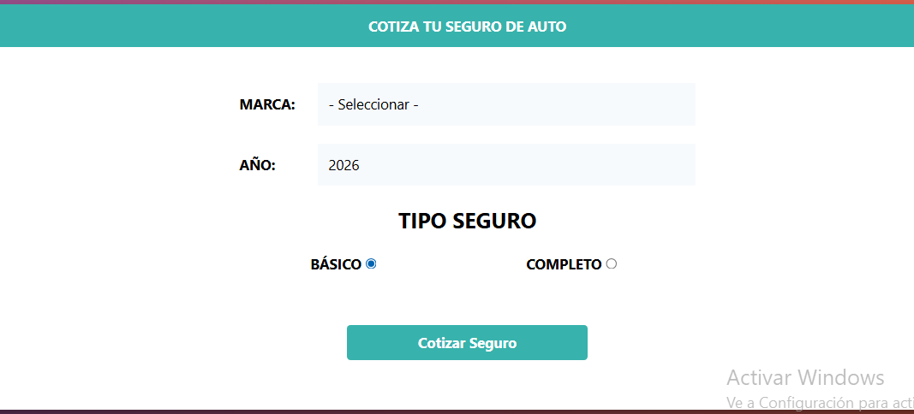
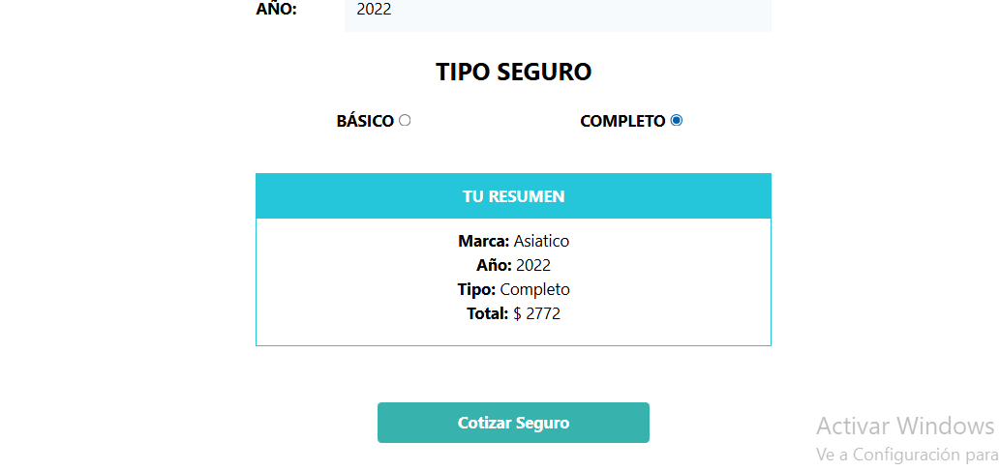

# Seguro Prototypes



Un prototipo interactivo de sitio web para seguros, diseñado para demostrar funcionalidades básicas de un portal de seguros en línea. Incluye formularios, navegación y elementos visuales atractivos.

## 🚀 Demo en Vivo

Puedes ver una demo en vivo del proyecto aquí: [Demo en Vivo](https://seguros-green.vercel.app/) <!-- Reemplaza con el enlace real de GitHub Pages si lo tienes configurado -->

## 📸 Capturas de Pantalla

### Página Principal


### Formulario de Contacto


## 🛠 Tecnologías Usadas

- **HTML5**: Estructura del sitio web
- **CSS3**: Estilos personalizados
- **Tailwind CSS**: Framework CSS para diseño responsivo y moderno
- **JavaScript**: Interactividad y lógica del lado del cliente

## 📦 Instalación y Uso

1. Clona el repositorio:
   ```bash
   git clone https://github.com/tu-usuario/seguro-prototypes.git
   ```

2. Navega al directorio del proyecto:
   ```bash
   cd seguro-prototypes
   ```

3. Abre `index.html` en tu navegador web preferido.

No se requieren dependencias adicionales, ya que es un proyecto estático.

## 🤝 Contribución

Las contribuciones son bienvenidas. Por favor, abre un issue o envía un pull request para mejoras.

## 📄 Licencia

Este proyecto está bajo la Licencia MIT. Consulta el archivo [LICENSE](LICENSE) para más detalles.

## 👤 Autor

**Javier Berchtold  (JEB$DEV)**  
- GitHub: (https://github.com/JEB76-22) <!-- Reemplaza con tu usuario real -->
- Email: j.e.b.inter@gmail.com <!-- Reemplaza con tu email -->

---

¡Gracias por visitar Seguro Prototypes! Si tienes preguntas o sugerencias, no dudes en contactarme.
